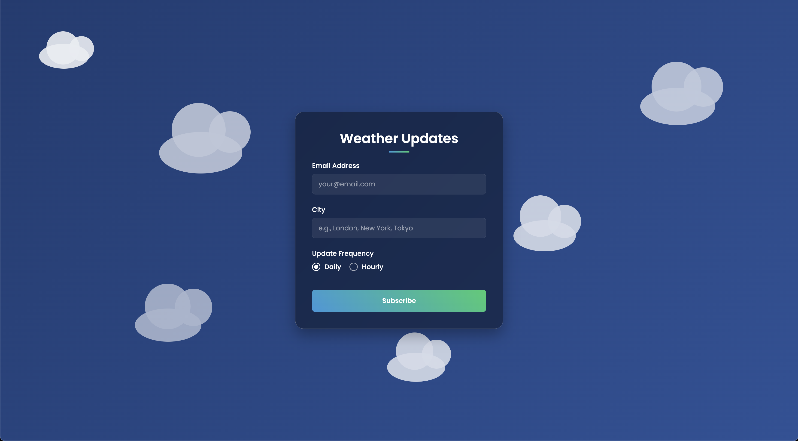

# Weather subscription API



Click [here](https://weather-subscription-api.onrender.com/) to see live demo, or [here](https://youtu.be/eeF0H_TPaqQ) to see how the whole flow looks on my end 🌦️

## 📋 Overview

A NestJS application that allows users to subscribe to regular weather updates for their chosen cities. Users can select daily or hourly updates and receive emails with current temperature, humidity, and weather descriptions.

## 🛠️ Technologies

- **Framework:** NestJS, TypeScript

- **Database:** PostgreSQL, TypeORM

- **Email:** Nodemailer

- **Scheduling:** @nestjs/schedule

- **Container:** Docker, Docker Compose

- **Weather Data:** [WeatherAPI](https://www.weatherapi.com/)

- **Frontend:** HTML, CSS, JavaScript

- **Deployment** [Render](https://render.com/)

## 🔍 API Endpoints

| Endpoint                   | Method | Description                    | Errors                                                                        |
| -------------------------- | ------ | ------------------------------ | ----------------------------------------------------------------------------- |
| `/api/weather?city={city}` | GET    | Get current weather for a city | `400` - Missing city parameter<br>`404` - City not found<br>`500` - API error |
| `/api/subscribe`           | POST   | Subscribe to weather updates   | `400` - Invalid input<br>`409` - Already subscribed<br>`500` - Server error   |
| `/api/confirm/{token}`     | GET    | Confirm subscription           | `404` - Invalid/expired token<br>`500` - Server error                         |
| `/api/unsubscribe/{token}` | GET    | Unsubscribe from updates       | `404` - Invalid token<br>`500` - Server error                                 |

## 🚀 Running Locally

1. Clone the repository

```bash
git clone https://github.com/ksalpern/weather-subscription-api.git
cd weather-subscription-api/weather-api
```

2. Create .env file and edit it with your values

```bash
cp .env.example .env
```

3. Start the app using Docker (recommended)

```bash
docker compose -f docker-compose.yml up
```

3. Start the app without Docker

```bash
# Install dependencies first
pnpm install

# Run database migrations
pnpm run migration:run

# Start in development mode
pnpm run start:dev
```

## 💡 Ideas for improvement

- **3D weather visualization:** Implement Three.js for interactive 3D weather elements

- **Beautiful email templates:** as now emails are quite ugly 😁

- **Custom confirmation pages:** Styled confirmation and unsubscribe success pages

- **Weather alerts:** Special notifications for extreme weather conditions

- **Real-time updates:** WebSocket support for live weather changes

- **Multiple weather providers:** Fallback options if primary API fails

- **Analytics:** Track subscription patterns and popular cities
